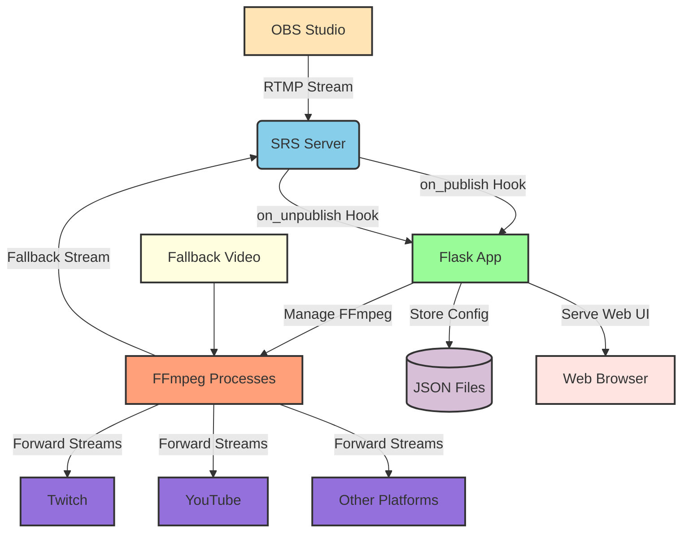

# Restream Server Architecture

## Component Descriptions

### OBS Studio
- Publishes RTMP stream to SRS server
- Uses URL: `rtmp://server/live/STREAM_KEY`

### SRS Server
- Receives RTMP streams
- Calls HTTP hooks on stream events:
  - `on_publish`: When stream starts
  - `on_unpublish`: When stream stops
- Forwards streams to FFmpeg processes for distribution
- Receives fallback streams from FFmpeg

### Flask Application
- Handles HTTP hooks from SRS
- Manages streaming platform configurations
- Controls FFmpeg processes
- Provides web interface for management
- Stores platform configurations in JSON files

### FFmpeg Processes
- Forward incoming streams to platforms (Twitch, YouTube, etc.)
- Stream without re-encoding (copy codec)
- Play fallback video when main stream stops
- Managed by Flask application

### JSON Files
- Store platform configurations
- Store stream status information

### Web Browser
- Accesses Flask web interface
- Manages platforms and uploads fallback video

### Streaming Platforms
- Receive forwarded streams from FFmpeg processes
- Include Twitch, YouTube, Trovo, etc.

### Fallback Video
- MP4 video played when main stream is disconnected
- Configured through web interface